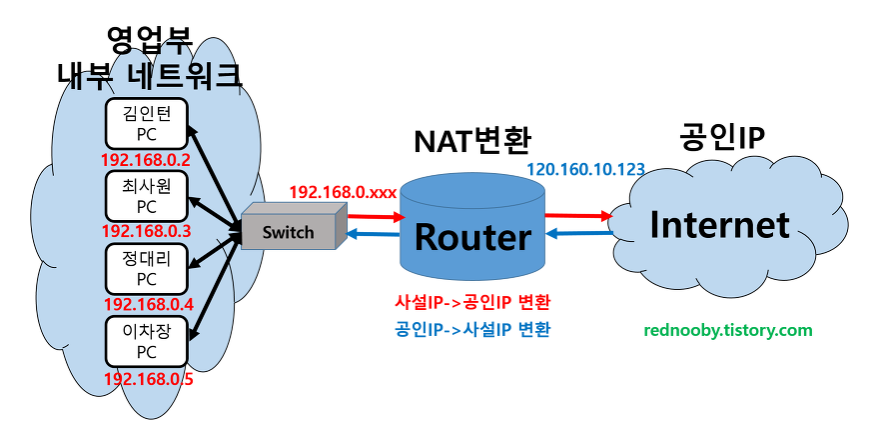

# E-Commerce

> https://www.lucidchart.com/blog/how-to-build-aws-architecture-diagrams

> https://blog.ezrabowman.com/cost-effective-aws-architectures-for-wordpress-and-other-websites/

> https://www.techtruffle.com/blog/aws/three-tier-architecture/

## AWS 웹 구축

> NDS https://tech.cloud.nongshim.co.kr/techblog/

####  Nat

- NAT(Network Address Translation): 네트워크 주소 변환

  > IP 패킷의 TCP/UDP 포트 숫자와 소스 및 목적지의 IP 주소 등을 재기록하면서 라우터를 통해 네트워크 트래픽을 주고 받는 기술

  - 사설 네트워크에 속한 여러 개의 호스트가 하나의 공인 IP 주소를 사용하여 인터넷에 접속하기 위함

  - 인터넷 공인 IP 주소 절약

  - 침입자로부터 고유한 사설망 보호

    > 방화벽

- AWS NAT

  | NAT Gateway            | NAT Instance               |
  | ---------------------- | -------------------------- |
  | VPC의 NAT Gateway 이용 | EC2에서 NAT 설치, AMI 존재 |
  | 비쌈 = 월 10만원       | EC2 가격                   |

#### Bastion Host

> 하루 3분 IT https://m.blog.naver.com/PostView.nhn?blogId=pentamkt&logNo=221034903499&proxyReferer=https:%2F%2Fwww.google.com%2F

> 내부와 외부 네트워크 사이에서 일종의 게이트 역할을 수행하는 호스트

###### Nat vs Bastion

- Nat: 인터넷 트래픽을 EC2 인스턴스 및 프라이빗 서브넷 제공

- Bastion: EC2 인스턴스 관리

  > Public에 Bastion 호스트 추가 > 사용자가 프라이빗 서브넷이 있는 EC2에 SSH 사용

결론: Nat는 외부 접속을 위한 것

#### Route Table

> 패킷이 목적지, 목적지까지의 거리와 가는 방법을 명시하는 테이블

##### Routing

> 한 네트워크에서 다른 네트워크로 패킷을 이동시키는 과정, 네트워크 안의 호스트에게 패킷을 전달하는 과정

**:question: Nat와 Gateway를 하나의 VPC에서 연결하려고 할 때, Route Table을 따로 설정해야 하는가?**

> :o: IGW <- NAT 연결

:question: **IGW를 Route Table에 설정 시, 모든 Subnet이랑 연결?**

> :x: Nat와 연결, Nat에서 private instance들을 연결해서 private와 internet연결

#### Load Balancer

- 유저 트래픽 분배
- DNS 제공
- SSL (HTTPS) 통신 지원
- 쿠키
- public / private 트래픽 분리

|      |                             ALB                              |                   NLB                   |            CLB            |
| ---- | :----------------------------------------------------------: | :-------------------------------------: | :-----------------------: |
| 정의 |                        Application LB                        |               Network LB                |        Classic LB         |
| 특징 |         Layer 7단에서 **HTTP(s) application** 스위칭         |     Layer 4에서 **TCP**, UDP 스위칭     |  Layer 4, 7 범용 스위치   |
|      |             IP, 람다, 인스턴스, 컨테이너, 콘텐츠             | EC2 인스턴스, 마이크로 서비스, 컨테이너 | 인스턴스 내부에서 LB 제공 |
|      |                 하나의 머신에 로드밸런싱 :o:                 |                                         |     잘 사용하지 않음      |
|      |               URL이나 Hostname을 통해 분배 :o:               |    정적 IP 주소 사용 = 고정 IP 활용     |                           |
|      | Port 매핑 :point_right: redirect 가능 복수의 앱 로드 밸런싱 :o: |       WebSocket 유형의 앱에 적합        |                           |
| 예시 |                       Docker, AWS ECS                        |                                         |                           |

* 해당 웹 구축에서는 web server에는 ALB를, WAS로는 NLB를 설정

  > web server: HTTPS 통신
  >
  > WAS: TCP 통신

- ALB 연결

  > https://brunch.co.kr/@topasvga/745

### EC2 연결

**VPN**

> 외부 :x: 단체 통신 :o: 사설통신망

**OpenVPN**

> 오픈소스 VPN, 세계 각지의 VPN, **오픈 소스 프로토콜**

#### Private Instacne에 접근

- 외부에서 접근 :x:

  :exclamation: 터널링으로 해결

##### 터널링

> 외부와 내부의 특정 지점을 통로로 만들어 줌

- **Putty**

  > https://dgoh.tistory.com/118
  >
  > Nat를 이용한 터널링 https://cloud.hosting.kr/aws-ec2/

  Connection > SSH > Tunnels

### WAS 설치

1. 자바 설치

   > https://gaemi606.tistory.com/127

2. Tomcat 설치

   > https://gaemi606.tistory.com/128

## 삽질

### 1. cannot find a valid baseurl for repo: amzn2-core/2/x86_64

> NAT Gateway가 설정되어 있지 않아서 발생하는 문제
>
> Nat Gateway의 route table에서 private instance와 연결

> Why? yum을 통한 설치는 인터넷으로 나가는 연결이 필요하기 때문 --> IGW - NAT, NAT - instance

### 2. #!/bin/bash

- #!

  > 스크립트를 실행할 쉘을 지정하는 선언문

#### 3. ALB 접속이 오래 걸리는 이유

> ALB와 instance 연결이 제대로 안 되어 있었던 듯.. 삭제하고 다시 하니 :o:

### 4. Tomcat 8080 port

> 보안그룹에서 8080 port를 열어줘야 함 -> 재접속

### 5. Apach와 Tomcat 연동

- connector

  > 어떤 서버에 설치..?
  >
  > 낼해야징.......