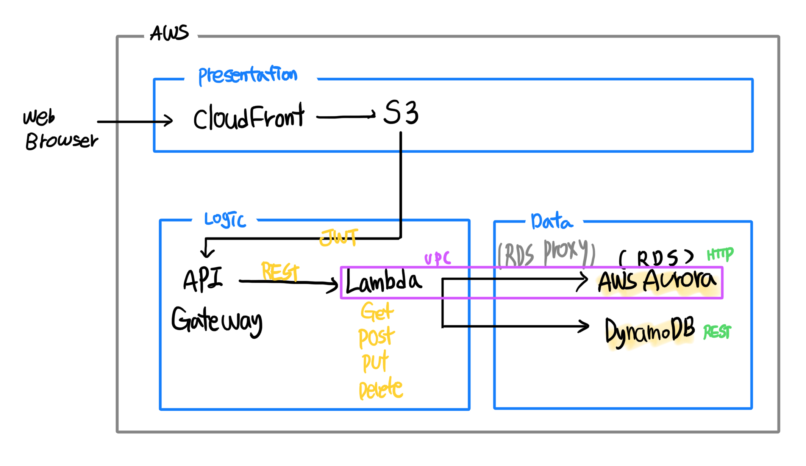
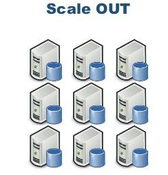

# ServerLess



> CloudFront, S3, API Gateway, Lambda :point_right: VPC 설정 :x:
>
> Serverless에서 VPC는 데이터 영역만 주의하면 된다.
>
> > RDS는 VPC 연결 필수 :point_right: Lambda도 같은 VPC 영역 :o:
> >
> > DynamoDB :point_right: VPC 설정 :x:

* White Board 준비

  > 안녕하세요 Serverless White Board session 발표를 맡은 김지홍 입니다.
  >
  > Serverless를 직역하면 어떻게 해석이 될까요? Server와 Less, 즉 Server가 없다는 뜻입니다.
  >
  > 그러나 실제로 Serverless는 서버가 아에 존재하지 않는다는 것은 아닙니다. 서버는 존재하지만, 더 이상 신경 쓸 필요가 없다는 것입니다.
  >
  > 그렇다면 어떤 방법을 이용해야 Serverless 환경을 구축할 수 있을까요?
  >
  > - 제안 조건 (필기)
  >
  > 이번 White Board 세션에서 제가 받은 조건은 DB와 API Gateway, Lambda를 사용한 REST 통신이 가능한 Serverless 환경입니다.
  >
  > 사용자가 웹 브라우저를 통해 REST를 요청하기 위해 S3에 존재하는 정적 웹 사이트를 CloudFront를 통해 접속합니다. 여기서 보통 Route53과 같은 도메인을 주지만, 간단한 REST 환경이므로 가격이 비싼 도메인 환경을 제거하였습니다.
  >
  > 사용자가 한 REST 요청은 API Gateway에게 전달됩니다. API Gateway는 REST API 기반으로 생성되어, REST기능을 하는 Lambda 함수를 작동시킵니다.
  >
  > Lambda는 함수 단위로 서버를 실행합니다. 필요한 기능을 Lambda를 통해 작동할 수 있습니다. 여기서는 REST를 위해서 DynamoDB에 접근합니다. DynamoDB는 비관계형 함수로, Scale out을 한다는 강점을 가지고 있습니다. Lambda는 필요할 때마다 서버에 접근하기 때문에, Cold Start의 경우 매번 새로운 Connect이 생성하게 됩니다. 이것은 DB의 용량이 더욱 필요하다는 것을 의미하므로, Scale UP을 하는 RDS는 사용하기에 부적절 할 수 있습니다. 따라서, DynamoDB로 Lambda 사용에 최적화를 진행합니다.
  >
  > > RDS를 사용한다면 RDS_PROXY를 사용할 수 있습니다. 그러나 위와 같은 이점으로 반드시 관계형 DB를 사용해야 하는 상황이 아니라면 DynamoDB가 Lambda에 사용하기에 적절합니다.
  >
  > 이렇게 구성을 하면 Cloudfront와 S3는 Presentation, API와 Lambda는 Logic, DynamoDB는 Data tier로 하여 아키텍처를 나눌 수 있습니다.
  >
  > 그리고 이 모든 것을 CloudWatch를 통해 로그를 확인할 수 있고, 다양한 Serverless Framwork를 통해 API gateway와 Lambda를 매번 엮는 별도의 과정을 겪을 필요가 없습니다. 

* 예상 QnA

  - RDS 대신 DynamoDB 사용 이유
    - Aurora: HTTP Access
    - 다른 RDS: Scale Up :point_right: connect이 계속 될 경우 Scale Up 필요, Scale Up은 비싸고 어려움
    - DynamoDB: Scale Out, REST Access 기반
  - CloudFront 사용 이유
    - S3만 이용해서 정적 웹 사이트 배포 :point_right: http 접근, 보안 :x:
    - CloudFront: http :point_right: https 접근
  - IAM: Lambda에 적용하여 DynamoDB 연결 :o:
  - 보안
    - API Gateway에서 대부분 자동으로 :o:
    - CloudFront
    - S3 등 priavte로 설정

:bookmark: 참고사이트

> 3 tier Architecture https://www.techiexpert.com/serverless-multi-tier-architecture-on-aws/
>
> :play_or_pause_button: Lambda로 게시판 서버 API 생성 https://www.youtube.com/watch?v=x0iyaENTxU0
>
> Lambda & Gateway 시작 및 연결 https://gun0912.tistory.com/60
>
> SQL vs NoSQL https://medium.com/harrythegreat/aws-%EC%84%9C%EB%B2%84%EB%A6%AC%EC%8A%A4%EB%A5%BC-%EC%9C%84%ED%95%9C-rds-proxy%EC%84%9C%EB%B9%84%EC%8A%A4-fb5815b83cce
>
> Serverless - SQL/NoSQL https://blog.thundra.io/which-database-should-i-choose-for-my-serverless-applications
>
> dynamoDB https://www.slideshare.net/awskorea/aws-database-hands-on-lab-aws-gaming-on-aws-2018
>
> lambda - gateway - dynamodb https://medium.com/@yumenohosi/aws-lambda-api-gateway-dynamodb-node-js-%EC%82%AC%EC%9A%A9%EA%B8%B0-%EC%82%BD%EC%A7%88%EA%B8%B0-b5352e00b396
>
> dynamo 연결 실습 https://blog.naver.com/PostView.nhn?blogId=scw0531&logNo=221451926933&parentCategoryNo=&categoryNo=52&viewDate=&isShowPopularPosts=false&from=postView
>
> serverless 배포 https://velopert.com/3577
>
> (Azure) 고려 사항 https://docs.microsoft.com/ko-kr/dotnet/architecture/serverless/serverless-design-examples
>
> ---
>
> Lambda - RDS 연결 https://base-on.tistory.com/73
>
> 정적 웹 사이트 생성 및 배포 https://ongamedev.tistory.com/entry/S3-%EC%A0%95%EC%A0%81-%EC%9B%B9%EC%82%AC%EC%9D%B4%ED%8A%B8%EB%A5%BC-https%EB%A1%9C-%EC%A0%91%EC%86%8D%ED%95%98%EA%B8%B0
>
> ---
>
> Serverless 프레임 워크 https://ndb796.tistory.com/311?category=1045560 --> 나동빈 블로그
>
> serverless Framework https://novemberde.github.io/aws/2017/08/14/Serverless.html

### 특징

> https://brunch.co.kr/@yesjun/3

- 서버 시스템 관리 :x:

- 무상태(Stateless) 기반

- 자동으로 프로세스(성능) 확장

- 운영 비용 :x: :point_right: 이벤트 기반 비용 :o:

- 첫 번째 이벤트 처리 시 시작 시간 필요

- 런타임 분리 :point_right: 보안 :o:

  > 런타임을 분리하는 것이 왜 보안에 강한가?

- ColdStart가 존재

  > 첫 이벤트 처리 시 약간의 시간 소요

  > ColdStart가 일어나지 않을려면 어떻게 해야하는 가?
  >
  > - 지속적으로 함수를 실행시킨다
  > - 돈에 관한 문제 -> 고객사의 요구사항


## API Gateway

> https://meetup.toast.com/posts/201

- 규모와 관계 없이 REST 및 WebSocket API 생성, 게시, 유지, 모니터링, 보호

- RESTful API 생성

  - HTTP 기반
  - 상태 비저장 Client - Server 통신 활성화
  - 표준 HTTP Method (CRUD)
  - REST Endpoint 제공 :point_right: 함수 실행

- 통합적 엔드포인트와 RETS API 관리

  > 엔드포인트: 소프트웨어나 제품의 최종 목적지(사용자) ex) PC, 노트북, 핸드폰 등

- 여러 개의 API 서버로 부하를 분산


## 데이터베이스

### RDS(SQL)

- Scale-Up

  

  - 테이블이 수평적으로 커짐

  - 기존 DB 시스템 :arrow_right: 고성능의 DB 시스템

- 고정적인 DB Schema

  - 유연 :x:

:star: Lambda에서 SQL을 사용할 때

> ColdStart

- Lambda는 필요할 때만 연결되는 함수
- SQL과 connect가 자주 끊어짐
- connect 연결 시, 새로운 커넥션을 필요하게 됨 -> Scale Up 필요

###### RDS PROXY

> RDS Connect 관리

- AWS Secret Manager 세팅

:exclamation: 서버리스 SQL 형태인 Aurora 존재

- HTTP 액세스
- 유연성
- 관계형 DB

### DynamoDB(NoSQL)

- Scale-Out

  

  - 여러 DB 시스템 추가
    - 무한대로 증설 가능

- 유연한 DB Schema

  > 자주 변하는 데이터 구조


#### DynamoDB와 Node.js 연결 코딩

> https://software-creator.tistory.com/16
>
> DELETE https://gist.github.com/kiewic/b175e6a926d3ddd7277463980e8bd3b2
>
> 전체 정리 https://www.theteams.kr/teams/2440/post/67303

```js
//GET
//검색할 Table이름과 Key값
const params = {
    TableNaeme: "Food",
    Key: {
        "type": "Korean",
        "name": "Soybean pastestew"
    }
}

//POST
const params = {
    TableName: tableName,
    Item: {
        "type:" : "Western",
        "name" : "Carbonara",
        "ingredients" :{
            "egg" : "1",
            "spaghetti" : "90g"
        }
    }
}

//PUT
const params = {
    TableName: tableName,
    Key: {
        "type": "Western",
        "name": "Carbonara",
    },
    UpdateExpression: "set price = :price", //수정할 것 선택
    ExpressionAttributeValues:{ //수정할 것의 값
        ":price": 15000
    }
}

//DELETE
const params={
    TableName: tableName,
    Key:{
        "type": "Korean",
        "name": "Soybean pastestew",
    },
    ConditionExpression: "price <= :price", //조건
    ExpressionAttributeValues:{ //가격
        ":price": 8000
    }
}

//DELETE -> 2
const params={
    TableName: tableName,
    Key:{
        "type": "Korean", // 삭제할 것의 Key 입력
    },
}


			case 'DELETE':
                body = await dynamo.delete(params).promise();
                break;
            case 'GET':
                body = await dynamo.scan(payload).promise();
//				docClient.get(params).promise();
                break;
            case 'POST':
                body = await dynamo.put(params).promise(); //params에 있는 item 값을 add
                break;
            case 'PUT':
                body = await dynamo.update(params).promise();
                break;
```


## 정적 웹사이트 호스팅

https://devlog-h.tistory.com/11


## 삽질

### 1. Lambda - DynamoDB 연결

- DynamoDB 연결 시 에러 발생

  . Cannot access stream arn:aws:dynamodb:ap-northeast-2:527478947915:table/serverless_1/stream/2020-10-21T05:15:39.587. Please ensure the role can perform the GetRecords, GetShardIterator, DescribeStream, and ListStreams Actions on your stream in IAM. (Service: AWSLambda; Status Code: 400; Error Code: InvalidParameterValueException; Request ID: 22d8f50c-d443-4d6c-84e2-c74c04f455f5; Proxy: null)

  > https://stackoverflow.com/questions/46276837/aws-lambda-not-connecting-with-dynamo-db

  - IAM 설정 필요

    IAM에서 액세스 권한을 주지 않으면 기본적으로 접근할 수 없는 듯

    > IAM은 Lambda 함수 생성 후 바꿀 수 없는가?
    >
    > > IAM 창에서 정책 연결로 설정 가능

    > IAM 에서 
    >
    > ```
    > {
    >          "Effect": "Allow",
    >          "Action": [
    >              "dynamodb:DescribeStream",
    >              "dynamodb:GetRecords",
    >              "dynamodb:GetShardIterator",
    >              "dynamodb:ListStreams"
    >          ],
    >          "Resource": "arn:aws:dynamodb:ap-northeast-2:527478947915:table/*"
    > }
    > ```
    >
    > 해당 정책 설정 -> JSON으로 정책 편집 가능

  - AWS 공식 문서

    > https://aws.amazon.com/ko/getting-started/hands-on/build-serverless-web-app-lambda-apigateway-s3-dynamodb-cognito/module-3/

    

### 2. Lambda - VPC 설정

- The provided execution role does not have permissions to call CreateNetworkInterface on EC2

  > https://ao.gl/the-provided-execution-role-does-not-have-permissions-to-call-createnetworkinterface-on-ec2/

  - IAM 설정

    > ```
    > {
    > "Effect": "Allow",
    > "Action": [
    > 	"ec2:DescribeNetworkInterfaces",
    >  "ec2:CreateNetworkInterface",
    >  "ec2:DeleteNetworkInterface",
    >  "ec2:DescribeInstances",
    >  "ec2:AttachNetworkInterface"
    > ],
    > "Resource": "*"
    > }
    > ```

### 3. invoke API를 호출하면 이 메시지를 사용한 작업에 실패했습니다. Rate Exceeded.

> 해결 못함

### 4. Gateway URL

> 배포를 하면 된다.
>
> ```
> {"message":"Missing Authentication Token"}
> ```
>
> > link 뒤에 /board, 리소스 정보를 줄 것
>
> https://sarc.io/index.php/aws/767

> html 입히기
>
> - 보안적인 문제로 인해 HTML을 일반적으로 두게 되면 CORS 에러 발생

### 5. 502 Bad Gateway

> https://medium.com/@yumenohosi/aws-lambda-api-gateway-dynamodb-node-js-%EC%82%AC%EC%9A%A9%EA%B8%B0-%EC%82%BD%EC%A7%88%EA%B8%B0-b5352e00b396

- CloudWatch에서 로그 확인 -->

  - Malformed Lambda proxy response.

    > lambda 호출 시 원하는 response 형태가 정해져 있음
    >
    > ```js
    >  return {
    >         statusCode,
    >         body,
    >         headers,
    >     };
    > ```
    >
    > 해당 형식을 꼭 지켜야 함

### 6. VPC 설정

> https://changhoi.github.io/posts/serverless/serverless-vpc-deploy-demo/

- 간단한 프로젝트

  > 별다른 옵션 없이 Public한 오픈 API

- 개발 서버 분리 || 일정 기간 동안 유지 보수 및 배포

  > 내부 VPC에서 배포필요
  >
  > - S3, DynamoDB 접근을 위해 NAAT Gateway || VPC Endpoint 필요

### 7. HTML로 접근 시 CORS 에러

:warning: Access to fetch at 'https://92ziazl1wi.execute-api.ap-northeast-2.amazonaws.com/2020-10-22/board' from origin 'null' has been blocked by CORS policy: No 'Access-Control-Allow-Origin' header is present on the requested resource. If an opaque response serves your needs, set the request's mode to 'no-cors' to fetch the resource with CORS disabled.

```js
 callback(null, { 
                    'statusCode': 200, 
                    'headers': {'Access-Control-Allow-Origin': '*'},
                    'body': JSON.stringify(body) }
                    );
}
```

> header에서 Allow 설정 필수!

### 8. CORS policy 에러

:warning: Access to XMLHttpRequest at 'file:///C:/Users/jihong.kim/Desktop/serverless/[object%20Object]' from origin 'null' has been blocked by CORS policy: Cross origin requests are only supported for protocol schemes: http, data, chrome, chrome-extension, https.

> https://velog.io/@takeknowledge/%EB%A1%9C%EC%BB%AC%EC%97%90%EC%84%9C-CORS-policy-%EA%B4%80%EB%A0%A8-%EC%97%90%EB%9F%AC%EA%B0%80-%EB%B0%9C%EC%83%9D%ED%95%98%EB%8A%94-%EC%9D%B4%EC%9C%A0-3gk4gyhreu

```
npm install http-server -g
npx http-server
(chrome 주소창) http://127.0.0.1:8080 - 해당 파일에 접속
```

- CORS 해결법: 서버에 올려서 해결
- Why?
  - 자바 스크립트 모듈 보안 요구사항
  - 파일 리소스 요청 시 origin(출처)가 null로 넘어감

### 9. jQuery ajax post 405 method not allowed

> https://stackoverrun.com/ko/q/10901283

ajax에 type: post 명시

### 10. API Gateway Ajax POST 400 error

> https://stackoverflow.com/questions/38987256/aws-api-gateway-cors-post-not-working

Ajax에서 data 전송 시, json.stringfy를 해줘야 형식이 맞음..

### 11. jQuery로 특정 위치에 html 뿌리기

> https://stackoverflow.com/questions/55371920/display-data-in-table-on-ajax-success

div로 영역 + id 잡아준 후 해당 위치에 .html(html);

### 12. This XML file does not appear to have any style information associated with it. The document tree is shown below.

> https://zamezzz.tistory.com/299

s3 버킷을 public으로 설정


## PoC

> Proof of Concept
>
> 검증할 주요 내용에 대한 목표 설정 :point_right: 프로토타이핑 :point_right: 배포를 통해 **개념 증명**

- 프로토타입 및 배포
- 검증
- 실현 여부 판단
