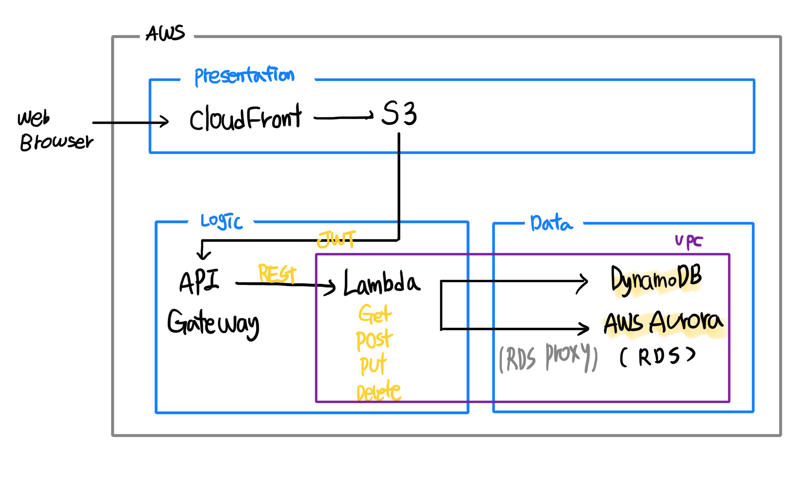

# ServerLess



> CloudFront, S3, API Gateway, Lambda :point_right: VPC 설정 :x:
>
> Serverless에서 VPC는 데이터 영역만 주의하면 된다
>
> > RDS는 VPC 연결 필수 :point_right: Lambda도 같은 VPC 영역 :o:
> >
> > DynamoDB :point_right: VPC 설정 :x:


:bookmark: 참고사이트

> 3 tier Architecture https://www.techiexpert.com/serverless-multi-tier-architecture-on-aws/
>
> :play_or_pause_button: Lambda로 게시판 서버 API 생성 https://www.youtube.com/watch?v=x0iyaENTxU0
>
> Lambda & Gateway 시작 및 연결 https://gun0912.tistory.com/60
>
> SQL vs NoSQL https://medium.com/harrythegreat/aws-%EC%84%9C%EB%B2%84%EB%A6%AC%EC%8A%A4%EB%A5%BC-%EC%9C%84%ED%95%9C-rds-proxy%EC%84%9C%EB%B9%84%EC%8A%A4-fb5815b83cce
>
> Serverless - SQL/NoSQL https://blog.thundra.io/which-database-should-i-choose-for-my-serverless-applications
>
> dynamoDB https://www.slideshare.net/awskorea/aws-database-hands-on-lab-aws-gaming-on-aws-2018
>
> lambda - gateway - dynamodb https://medium.com/@yumenohosi/aws-lambda-api-gateway-dynamodb-node-js-%EC%82%AC%EC%9A%A9%EA%B8%B0-%EC%82%BD%EC%A7%88%EA%B8%B0-b5352e00b396
>
> dynamo 연결 실습 https://blog.naver.com/PostView.nhn?blogId=scw0531&logNo=221451926933&parentCategoryNo=&categoryNo=52&viewDate=&isShowPopularPosts=false&from=postView
>
> serverless 배포 https://velopert.com/3577
>
> ---
>
> Lambda - RDS 연결 https://base-on.tistory.com/73
>
> ---
>
> Serverless 프레임 워크 https://ndb796.tistory.com/311?category=1045560 --> 나동빈 블로그

### 특징

> https://brunch.co.kr/@yesjun/3

- 서버 시스템 관리 :x:

- 무상태(Stateless) 기반

- 자동으로 프로세스(성능) 확장

- 운영 비용 :x: :point_right: 이벤트 기반 비용 :o:

- 첫 번째 이벤트 처리 시 시작 시간 필요

- 런타임 분리 :point_right: 보안 :o:

  > 런타임을 분리하는 것이 왜 보안에 강한가?

- ColdStart가 존재

  > 첫 이벤트 처리 시 약간의 시간 소요

  

## 데이터베이스

### RDS(SQL)

- Scale-Up

  

  - 테이블이 수평적으로 커짐

  - 기존 DB 시스템 :arrow_right: 고성능의 DB 시스템

- 고정적인 DB Schema

  - 유연 :x:

:star: Lambda에서 SQL을 사용할 때

> ColdStart

- Lambda는 필요할 때만 연결되는 함수
- SQL과 connect가 자주 끊어짐
- connect 연결 시, 새로운 커넥션을 필요하게 됨 -> Scale Up 필요

###### RDS PROXY

> RDS Connect 관리

- AWS Secret Manager 세팅

:exclamation: 서버리스 SQL 형태인 Aurora 존재

- HTTP 액세스
- 유연성
- 관계형 DB

### DynamoDB(NoSQL)

- Scale-Out

  

  - 여러 DB 시스템 추가
    - 무한대로 증설 가능

- 유연한 DB Schema

  > 자주 변하는 데이터 구조


#### DynamoDB와 Node.js 연결 코딩

> https://software-creator.tistory.com/16
>
> DELETE https://gist.github.com/kiewic/b175e6a926d3ddd7277463980e8bd3b2
>
> 전체 정리 https://www.theteams.kr/teams/2440/post/67303

```js
//GET
//검색할 Table이름과 Key값
const params = {
    TableNaeme: "Food",
    Key: {
        "type": "Korean",
        "name": "Soybean pastestew"
    }
}

//POST
const params = {
    TableName: tableName,
    Item: {
        "type:" : "Western",
        "name" : "Carbonara",
        "ingredients" :{
            "egg" : "1",
            "spaghetti" : "90g"
        }
    }
}

//PUT
const params = {
    TableName: tableName,
    Key: {
        "type": "Western",
        "name": "Carbonara",
    },
    UpdateExpression: "set price = :price", //수정할 것 선택
    ExpressionAttributeValues:{ //수정할 것의 값
        ":price": 15000
    }
}

//DELETE
const params={
    TableName: tableName,
    Key:{
        "type": "Korean",
        "name": "Soybean pastestew",
    },
    ConditionExpression: "price <= :price", //조건
    ExpressionAttributeValues:{ //가격
        ":price": 8000
    }
}

//DELETE -> 2
const params={
    TableName: tableName,
    Key:{
        "type": "Korean", // 삭제할 것의 Key 입력
    },
}


			case 'DELETE':
                body = await dynamo.delete(params).promise();
                break;
            case 'GET':
                body = await dynamo.scan(payload).promise();
//				docClient.get(params).promise();
                break;
            case 'POST':
                body = await dynamo.put(params).promise(); //params에 있는 item 값을 add
                break;
            case 'PUT':
                body = await dynamo.update(params).promise();
                break;
```


## 정적 웹사이트 호스팅

https://devlog-h.tistory.com/11


## 삽질

### 1. Lambda - DynamoDB 연결

- DynamoDB 연결 시 에러 발생

  . Cannot access stream arn:aws:dynamodb:ap-northeast-2:527478947915:table/serverless_1/stream/2020-10-21T05:15:39.587. Please ensure the role can perform the GetRecords, GetShardIterator, DescribeStream, and ListStreams Actions on your stream in IAM. (Service: AWSLambda; Status Code: 400; Error Code: InvalidParameterValueException; Request ID: 22d8f50c-d443-4d6c-84e2-c74c04f455f5; Proxy: null)

  > https://stackoverflow.com/questions/46276837/aws-lambda-not-connecting-with-dynamo-db

  - IAM 설정 필요

    IAM에서 액세스 권한을 주지 않으면 기본적으로 접근할 수 없는 듯

    > IAM은 Lambda 함수 생성 후 바꿀 수 없는가?
    >
    > > IAM 창에서 정책 연결로 설정 가능

    > IAM 에서 
    >
    > ```
    > {
    >          "Effect": "Allow",
    >          "Action": [
    >              "dynamodb:DescribeStream",
    >              "dynamodb:GetRecords",
    >              "dynamodb:GetShardIterator",
    >              "dynamodb:ListStreams"
    >          ],
    >          "Resource": "arn:aws:dynamodb:ap-northeast-2:527478947915:table/*"
    > }
    > ```
    >
    > 해당 정책 설정 -> JSON으로 정책 편집 가능

  - AWS 공식 문서

    > https://aws.amazon.com/ko/getting-started/hands-on/build-serverless-web-app-lambda-apigateway-s3-dynamodb-cognito/module-3/

    

### 2. Lambda - VPC 설정

- The provided execution role does not have permissions to call CreateNetworkInterface on EC2

  > https://ao.gl/the-provided-execution-role-does-not-have-permissions-to-call-createnetworkinterface-on-ec2/

  - IAM 설정

    > ```
    > {
    > "Effect": "Allow",
    > "Action": [
    > 	"ec2:DescribeNetworkInterfaces",
    >  "ec2:CreateNetworkInterface",
    >  "ec2:DeleteNetworkInterface",
    >  "ec2:DescribeInstances",
    >  "ec2:AttachNetworkInterface"
    > ],
    > "Resource": "*"
    > }
    > ```

### 3. invoke API를 호출하면 이 메시지를 사용한 작업에 실패했습니다. Rate Exceeded.

> 해결 못함

### 4. Gateway URL

> 배포를 하면 된다.
>
> ```
> {"message":"Missing Authentication Token"}
> ```
>
> > link 뒤에 /board, 리소스 정보를 줄 것
>
> https://sarc.io/index.php/aws/767

> html 입히기
>
> - 보안적인 문제로 인해 HTML을 일반적으로 두게 되면 CORS 에러 발생

### 5. 502 Bad Gateway

> https://medium.com/@yumenohosi/aws-lambda-api-gateway-dynamodb-node-js-%EC%82%AC%EC%9A%A9%EA%B8%B0-%EC%82%BD%EC%A7%88%EA%B8%B0-b5352e00b396

- CloudWatch에서 로그 확인 -->

  - Malformed Lambda proxy response.

    > lambda 호출 시 원하는 response 형태가 정해져 있음
    >
    > ```js
    >  return {
    >         statusCode,
    >         body,
    >         headers,
    >     };
    > ```
    >
    > 해당 형식을 꼭 지켜야 함

### 6. VPC 설정

> https://changhoi.github.io/posts/serverless/serverless-vpc-deploy-demo/

- 간단한 프로젝트

  > 별다른 옵션 없이 Public한 오픈 API

- 개발 서버 분리 || 일정 기간 동안 유지 보수 및 배포

  > 내부 VPC에서 배포필요
  >
  > - S3, DynamoDB 접근을 위해 NAAT Gateway || VPC Endpoint 필요

### 7. HTML로 접근 시 CORS 에러

Access to fetch at 'https://92ziazl1wi.execute-api.ap-northeast-2.amazonaws.com/2020-10-22/board' from origin 'null' has been blocked by CORS policy: No 'Access-Control-Allow-Origin' header is present on the requested resource. If an opaque response serves your needs, set the request's mode to 'no-cors' to fetch the resource with CORS disabled.

```js
 callback(null, { 
                    'statusCode': 200, 
                    'headers': {'Access-Control-Allow-Origin': '*'},
                    'body': JSON.stringify(body) }
                    );
}
```

> header에서 Allow 설정 필수!

