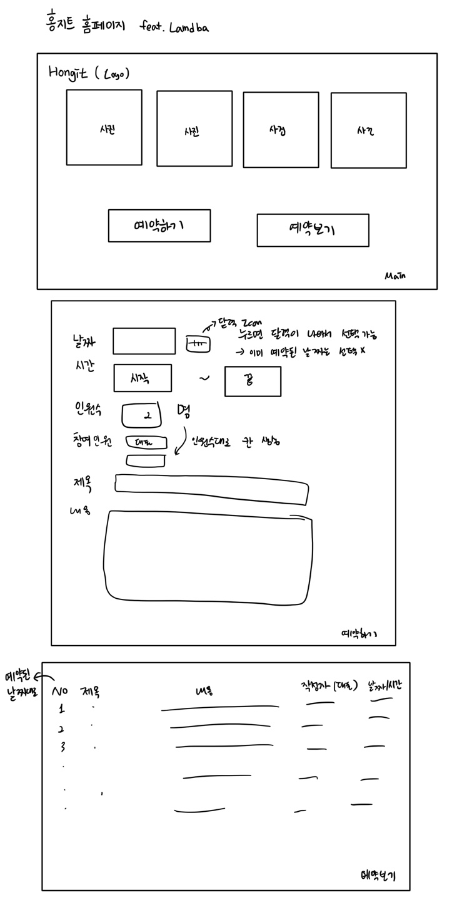

# Hongit Homepage

:computer: kakao oven

> https://ovenapp.io/view/k4ze2Xvqqc8fO67XXPuB7kagNLL88CiE/

:page_with_curl: paper prototype

## 환경

### 1. AWS

- #### Lambda

- #### API Gateway --> Zappa가 역할을 대신

- #### Dynamodb

  ###### boto3

  > dynamodb crud [https://medium.com/jhseo/boto3%EB%A5%BC-%EC%9D%B4%EC%9A%A9%ED%95%9C-dynamodb-query-d96f3b441f76](https://medium.com/jhseo/boto3를-이용한-dynamodb-query-d96f3b441f76)

  - Dynamodb와 Python연결

### 2. Python

### 3. Zappa

> Serverless 구축을 가능하게 해주는 Python Package

- API Gateway 자동 설정
- Django, Flask 활용 --> 디버깅 가능

:link: https://sshkim.tistory.com/172

zappa test https://hidekuma.github.io/serverless/aws/lambda/apigateway/zappa/python-zappa/

:warning: **설치 에러 kappa (0.6.0)**

> https://m.blog.naver.com/PostView.nhn?blogId=skykbc&logNo=221370634678&proxyReferer=https:%2F%2Fwww.google.com%2F

- 2020.11.12 현재 python 3.9 version에서 작동:x:

###### 가상 환경 venv

- 설치된 라이브러리르들의 복사본을 만들어서 독립적인 가상 환경 구축

  - 하나의 기기에서 여러개의 프로젝트가 가지는 다른 의존성을 다룰 수 있음

- 설치

  > https://dgkim5360.tistory.com/entry/python-virtualenv-on-linux-ubuntu-and-windows

- 윈도우에서 venv 사용법

  > https://hcnoh.github.io/2019-06-19-windows-python-virtualenv

###### AWS CLI

> https://lovit.github.io/aws/2019/01/30/aws_s3_iam_awscli/

- aws 계정을 연동해야 zappa 사용가능
- cli 다운로드
- secret access key를 다운받아서 접근

