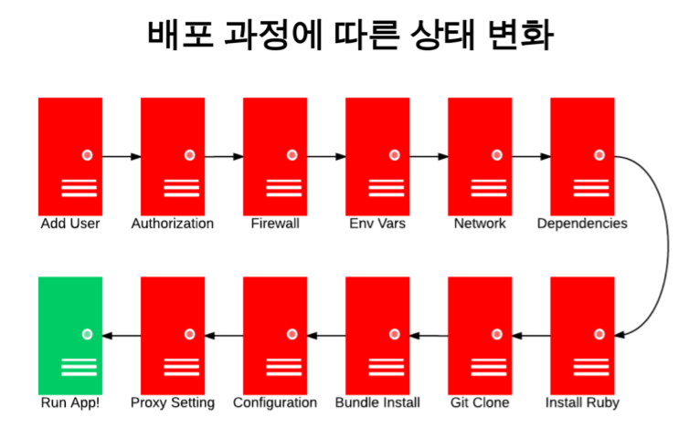
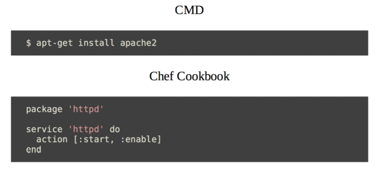
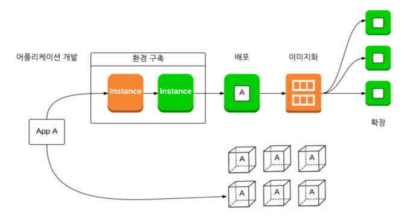
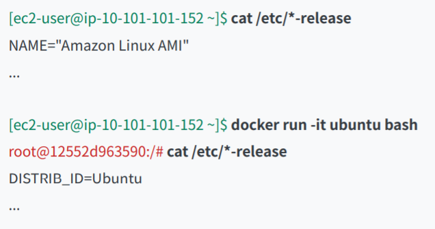
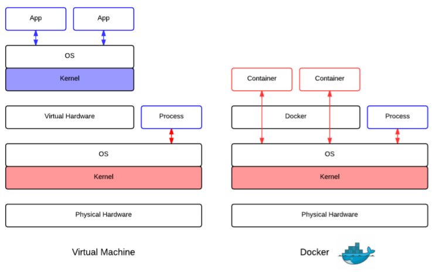
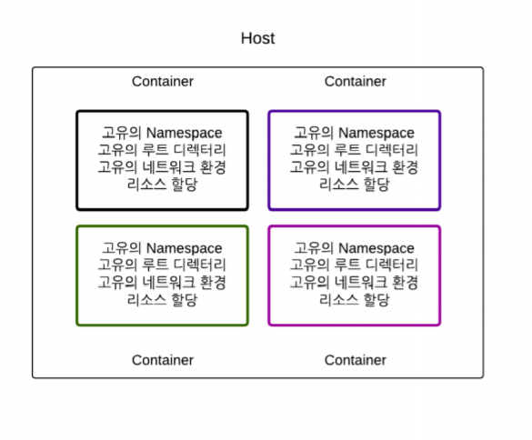
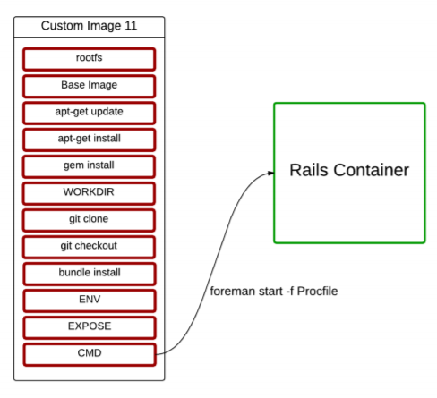

0921

---

# Docker

### 배경

#### 서버 운영

애플리케이션이 동작하는 상태를 유지하는 작업

- 프로비저닝

  > 애플리케이션이 동작하는 상태를 만드는 작업

- 배포

  > 프로비저닝된 서버에 애플리케이션을 실행

  - Application을 Server에서 실행시킴

  - 여러 단계를 거쳐야 하는데, 서버의 상태가 계속 바뀜

  

  - 배포 과정

    > 하나의 서버에 여러 개의 Applictaion 

    

    [D] 라는 새로운 Application 추가

    

- 서버 운영

  > 배포된 애플리케이션이 동작 가능한 **상태** 유지
  
  
  
  - 서버 운영이 어려운 이유
    1. 고유한 네트워크 환경, 하드웨어 파편화
    2. 하나의 서버에 다수의 애플리케이션 배포
    3. 명령어: 절차적, 휘발적, 재현불가능

#### Infrastructure

##### IaaS(Infrastructure as a Service)

- 클라우드, 하드웨어 가상화

- 같은 환경을 가짐(Instance 단위)

- 원하는 만큼만 사용 가능

- 이미지화 & 스케일 인/아웃

  ![image-20200921092651048]./typora-user-images/image-20200921092651048.png)

  > 하나의 앱을 여러개의 Instance로
  >
  > App을 복제해서 3개로 늘림

- 오토 스케일링

  

  > 원하는 만큼만 인스턴스 사용

	:star:이미지 수의 증가

	> 이미지의 수에 비례에해서 관리가 어려워 짐
	>
	> 이미지: 어떤 특정 시점의 상태를 저장한 것일 뿐
	>
	> > 어떻게 만들었는지 아무도 모름 (복원 불가)

###### 결론

![image-20200921093112432]./typora-user-images/image-20200921093112432.png)

> 리눅스로 명령어를 운영해야 하는 것은 여전함

##### Configuration Management

제현 가능한 서버 상태 관리를 위한 솔루션

ex) chef, puppet, ansible

- 멱등: 같은 과정을 거치면 서버는 똑같은 상태가 됨

  > Cookbook을 통한 상태 변화(chef)
  >
  > 같은 명령어

  

  > Infrastructure의 코드화: Git

  

  - 기존 CMD와 다르게 Chef Cookbook을 통해 상태 관리

- 서버 운영 추상화

  > 명령어를 통한 서버 관리X
  >
  > 상태 관리 코드 작성 -> 서버 적용
  >
  > 선언적 서버 상태 정의
  >
  > 서버 상태 재현 가능
  >
  > 서버 운영 협업

##### PaaS(Platform as a Service)

ex) Heroku: Dyno 단위에 App을 올리면 배포 가능

- **:star:App과 배포 단위의 1:1 매치**
- Scale In/Out 지원

- App 코드 수정 시 Push & Build가 새로 일어남

  > 롤백이 쉬움

- 배포 단순화

  

- 결론

  - 장점

    > 소스 코드만으로 배포
    >
    > 일반화된 프로비저닝 방법 제공 (단, 과정에 개입X)
    >
    > 서버 운영 없이 App 가능

  - 단점

    생각보다 어려움

    > App을 Pass 방식에 맞게 작성
    >
    > 서버에 대한 원격 접속 시스템 제공X
    >
    > 서버에 파일 시스템을 사용X
    >
    > Site 패키지 설치X
    >
    > 로그 수집 제한적 방식 허용(STDOUT)
    >
    > > 명령어를 치면 표준 출력으로 Dyno에 명령어를 보여주는 식으로만 보여줌

  - LXC(LinuX Container)

    파일 시스템을 분리함

### 정의

컨테이너 기반 가상화 도구

- 컨테이너: 격리된 환경에서 작동하는 프로세스

  > 리눅스 커널 기술
  >
  > 하드웨어 가상화 기술보다 가벼움
  >
  > **이미지** 단위로 프로세스 실행 환경 구성

- busybox: 다른 환경에서 돌아감

> 실행 환경이 바뀜

- 가상 머신과의 차이

  

  - Docker: Kernel을 공유

- 프로세스 실행 환경 분리

  

- 계층화된 저장장치(AUFS)

- 이미지(App이 돌아가는 환경) 공유

  

  > 배포 환경 설정

  - 빌드된 이미지

    호스트의 환경과 무관하게 실행 가능

    > Ruby, Rails, Node 없어도 실행 가능

- 배포 단위 = Docker Images

  App 실행 환경

##### Immutable Infrastructure

- 프로비저닝: 이미지 생성 시점에 완료

- 배포: 프로비저닝과 별도로 원하는 지점에

- 서버: 컨테이너를 실행시키기 위한 환경

  > 컨테이너 실행을 위한 최소한 환경
  >
  > 서버 상태를 적극적으로 관리X

  - 서버 없이 컨테이너 실행 서비스 등장 -> 서버 운영X

### 실습

http://52.78.185.183:4200/

ID: ubuntu

PW: apple-kiwi-apple

> 실제 외부 서버에 접속하는 것은 아님
