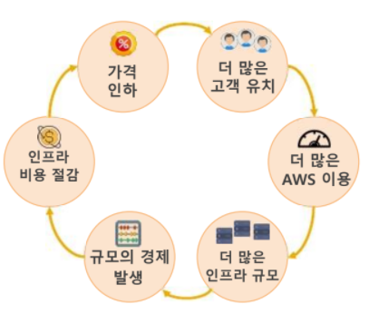
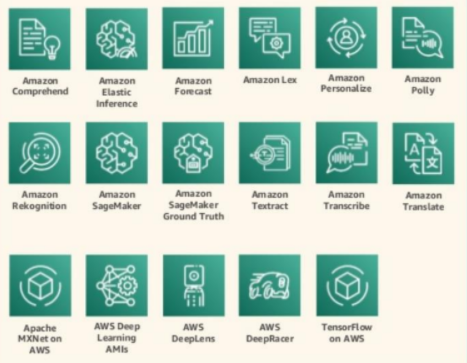
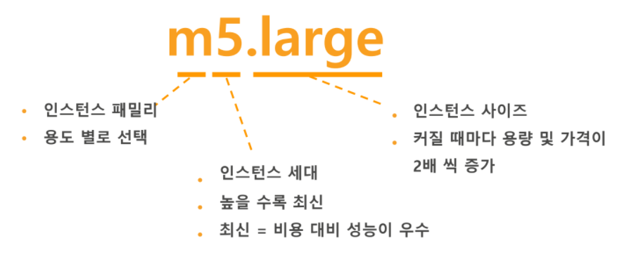
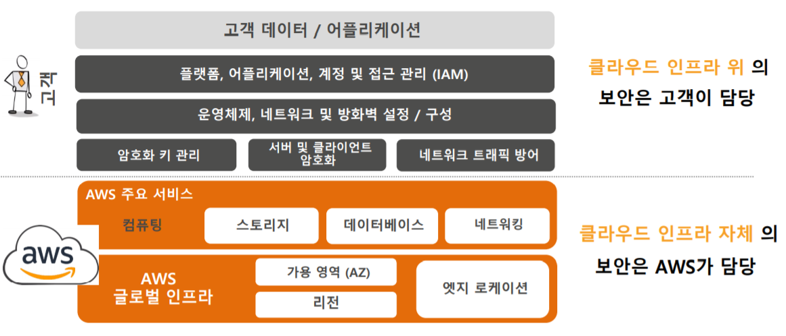

0924

DevOps 5팀 조영욱님

---

# Amazon Web Services

## Cloud Computing

- 필요할 때
- 사용한 만큼
- 유연한 용량
- 쉬움

#### 이점

- 초기 선투자 비용X

- 운영 비용 절감

- 탄련적인 운영 및 확장

  > 필요한 자원을 자동 증설 및 감소

- 속도 및 민첩성

  > 클라우드 기반 기업들이 새로운 시도, 민첩성으로 성공

- 비즈니스에만 집중 가능

  >  인프라 관리 업무 제거

- 글로벌 확장

## Why AWS?

- 넓고 깊은 서비스 포트폴리오
- 빠르고 지속적인 혁신 속도
  - 고객 지향 서비스
    - snowball: PB 데이터를 옮기는 안전한 박스 --> 바로 AWS로
- 
- 

## 주요 AWS 서비스

- 리전: AWS 서비스가 운영되는 지역
- 가용영역 (AZ): 데이터 센터들로 고가용성/이중화 구성의 기본 요소
- 엣지 로케이션: CloudFront 같은 엣지 서비스의 캐시 서버 (POP)

#### :computer:Core Services

:arrow_down_small:Compute

- EC2
- ECR
- ECS
- ...

:arrow_down_small:Storage

- S3
- Snowball

:arrow_down_small:Network & Content Delivery

- VPC: 서비스 (기본)
- S3: 도메인
- CloudFront: CDN 서비스

:arrow_down_small:Security, Identity & Compliance

- IAM
- Directory Service
- Inspector: 서버 보안
- KMS
- Certificate Manager: HTTPS 서비스

#### :computer:Platform Services

:arrow_down_small:Databases

- RDS
- DMS: 마이그레이션 서비스
- DynamoDB

:arrow_down_small:Application Integration

- SQS: push
- SNS: 이메일 발송

:arrow_down_small:Management Tools

- CloudTrall: 어떤 사람이 로그인 했는지
- CloudWatch: 사용량 확인
- Cloud Formation: 코드로 인프라 관리
- Auto Scaling
- **Command Line Interface**: 자동화 개발 시 사용

:arrow_down_small:Developer Tools

- CodeSeries
  - CodeCommit
  - CodeBuild
  - Codeploy
  - ...

:arrow_down_small:Internet of Things

- Iot Core

:arrow_down_small:Machine Learning

- 

:arrow_down_small:Media Service

- Elemental Media Convert: 영상 파일 인코딩

:arrow_down_small:Migration

:arrow_down_small:Cost Management

- Cost Explorer: 비용 얼마 확인
- Budgets: 알람

:arrow_down_small:Game Tech, Blockchain, ...

#### :computer:Enterprise Applications

:arrow_down_small:Business Applications

:arrow_down_small:Desktop & App Streaming

:arrow_down_small:Customer Engagement

### :cloud: EC2

> Virtual Machine
>
> 재구성
>
> 쉽게 확장/축소 (Auto Scaling)
>
> 다양한 인스턴스 타입 제공
>
> 사용한 만큼 과금
>
> - On-Demand
> - Reserved
> - Spot(경매)

- M5(범용), C5(컴퓨팅), R5(메모리), T2, T3, G3, P3, I2, D2

> :balance_scale: Auto Scaling
>
> 

> :headphones: Lambda
>
> - 서버리스 컴퓨팅 --> 코드만으로 특정 업무 처리
>
> - 반복적 작업 신속 처리
>
> - 오버 헤드 제거 --> 개발 속도 향상
>
> - 업로드, 트리거, 실행, 사용요금

### :basketball: Storage

> S3: 객체 스토리지
>
> - 객체 기반의 무제한 파일 저장 스토리지
>
> - URL 파일 공유
>
> - 사용한 만큼 지불
>
> - 정적 웹 사이트 호스팅

> EBS: 블록 스토리지
>
> - 한 개의 EBS가 여러 개의 EC2에 attach (9월 출시)
> - 한 개의 EC2가 여러 개의 EBS를 attach
>
> 

> CDN: 콘텐츠 전송 네트워크
>
> - 컨텐츠를 캐싱하여 성능 가속
> - DDos 방어 무료 제공

### :date: Database

> RDS
>
> - 자동 백업, 이중화 서비스
>
> Auror
>
> - 호환성(mySQL에서 변경 가능)

> DynamoDB
>
> - NoSQL DB
> - 높은 확장성
> - 느림

> ElastiCache
>
> - 인메모리 캐싱 서비스
> - CDN보다 가볍게

## AWS 고객 사례

- :secret: AWS 보안

  

---

## 실습

탄력적 IP

- restart 할 때 계속 IP가 바뀜
- 유동 IP

인스턴스 고급 세부 정보

- 인스턴스가 생성될 때 자동 설치 (자동화)
