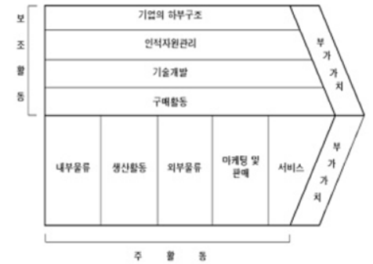
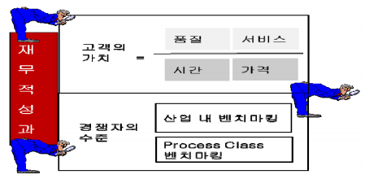
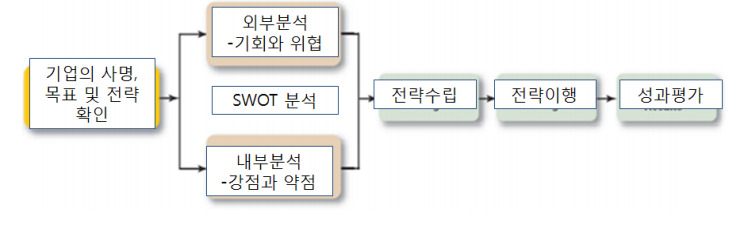
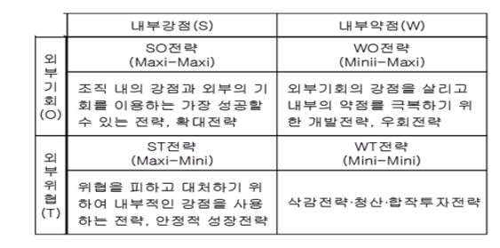
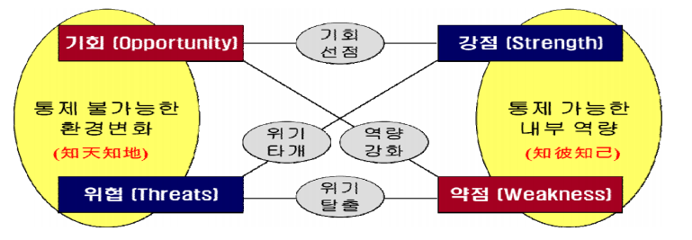

# IT 비즈니스 이해

1. 비즈니스 관점: IT 기술을 통해 기업의 다양한 경영활동을 더욱 **효율적이고 효과적으로** 수행하는 것
2. IT 관점: IT 제품을 생산하고 IT서비스를 제공하는 IT 관련 기업의 비즈니스 활동

> 기업의 경쟁 우위를 확보하기 위해 비즈니스 프로세스에 IT가 밀접하게 결합되는 구조로 발전

### 비즈니스와 IT의 연계

- 비즈니스 전략 목표 및 프로세스와의 상호의존성이 극대화된 개념

  - 기업의 비즈니스 모델 경쟁력 강화
  - 새로운 비즈니스 가치 창출

- 연계(alignment)

  > IT 조직이 비즈니스 전략과 비즈니스 프로세스를 지원 및 구현하는 수준

  - IT 응용프로그램
  - IT 인프라
  - IT 조직

- 연계 모델

  - 전략적 적합성  차원

    > 비즈니스 환경에 대한 외부 초점 및 관리 구조에 대한 내부 초점

    - 비즈니스 전략, IT 전략, 조직 인프라 및 프로세스, IT 인프라 및 프로세스

      > 구성요소: 고유의 범위, 능력, 거버넌스, 인프라, 프로세스, 기술

  - 기능적 통합성  차원

    > 비즈니스와 IT 구분

###### IT 비즈니스 개념과 특성

- 비즈니스 관점: 현대자동차가 전자상거래, SCM, ERP, 기업통신망 등 다양한 IT 도입 :point_right: **생산성 증가**
- IT 관점: 오라클(IT 회사)이 RDB(IT 기술) 기획, 제품 개발하여 일반 기ㅏ업에 마케팅과 영업을 함
- 3가지 관점
  - 새로운 비즈니스 창출(신규 수익)
  - 경쟁우위 무기로 활용(매출 증대)
  - 내부혁신 촉매로 활동(생산성 증대)

### IT 자원과 활동

#### IT 자원

> IT 비ㅏ즈니스를 영위하기 위해 활용되는 인력 및 프로세스, 소프트웨어, 하드웨어 등을 통합하여 설명하는 개념

- IT 자원 종류
  - IT 지원 시스템
    - ERP, SCM, PLM
    - IT 비즈니스를 지원하거나 관리하는 체계
  - 관리체계
    - ITSM
- 역할
  - 생산효율성 극대화
  - 새로운 비즈니스 가치 창출
  - 새로운 시장 개ㅑ척 및 글로벌 비즈니스 추구

##### IT 비즈니스 가치사슬

> 기업이 원재료를 사서 가공을 거쳐 고객에게 판매함으로써 **부가가치를 창출**하는 일련의 과정

- 물리적 가치창출(제품/서비스)

  > 직접적으로 고객들에게 전달되는 부가가치 창출 기여

  - 내부물류, 운영/.생산, 외부물류, 마케팅 및 판매, 서비스

- 보조활동

  - 기업의 하부구조, 인적자원관리, 기술개발, 구매활동

###### 가치 시스템

> 가치 시스템 하에서 기업은 공급사슬관리(SCM)을 통해 공급자와 관계를 맺음
>
> 고객관계관리(CRM)을 통해 수요자와 관게를 맺음
>
> 전사적 자원 관리(ERP)는 기업의 하부구조 차원을 넘어 전 영영을 망라하는 관리 기법

###### 가치 사슬 분석

> 원가 발생의 원천 및 경쟁기업과의 차별화 원천(가치창출 원천) 파악
>
> 자사의 내부 역량 및 경쟁 우위를 보다 체계적으로 발견

- 부가가치 창출과 관련된 핵심활동이 무엇인지 식별
- 핵심활동들의 강점과 약점, 차별화 요인, 원가동인 발견하는 과정으로 구성
- 각 가치활동들을 상호 독립적 활동들로 분리하여 분석X
- 서로 관련성과 연관성을 가진 상호 의존적 활동 파악
- 연계로 인한 시너지 효과 고려
- 기업 이익 = 기업 창출 가치에 - 가치 창출 활동에 소요되는 비용
  - 효율성, 차별화 필요

:exclamation: 비즈니스에서 가장 중요한 것 = 고객의 가치를 만족시키는 것 (고객 만족)

> 고객이 생각하지 못하는 새로운 가치를 주는 것 (고객 감동)

- 품질, 서비스, 시간, 가격

#### IT 비즈니스 환경

> 기회적 환경을 잘 이용하고 위협적 환경을 최소화화여 기업 조직 존석, 번영, 경영 환경에 대해 올바르게 이해하고자하는 노력이 필요

- 정치환경, 경제환경, 기술환경, 사회/문화환경 영향

- 경영전략

  > 기업이 장기적 목표를 세움, 정책 수립, 효율적 배분, 경쟁에 앞서는 경영활동

- 산업 구조 분석 모델

  - Michael Porter에 의해 창인
  - 사업영역 수준 전략 결정을 위한 고려 요인
    - 신규 진입자의 위협
    - 공급자의 협상력
    - 구매자의 협상력
    - 대체재 위협
    - 산업 내 기존 경쟁자간의 경쟁 강도

- SWOT 분석

  - Strength, weakness, opportunity, threat

  - 기업의 외부환경 중 기회와 위협이 되는 요소들을 기업 내부의 가점 및 약점에 대응시킨 것

  - 효율적 전략 수입 기법

  - 외부환경

    > 동일 산업에 속하는 경쟁 기업에게도 동일하게 기회와 위협으로 적용되는 요인
    >
    > 해당 기업이 다른 기업에 비해 상대적으로 갖는 강점과 약점을 나타냄

  - 내부환경

    > 다른 기업에 비해 상대적으로 갖는 강점과 약점

###### 경영 환경 분석

> 새로운 변화 이해, 내가 어떻게 행동해야 할 것인가에 대한 행동 방식 미리 규정

1. 나는 어디에 있는가?
2. 나는 어디로 가기를 원하는가?
3. 어떻게 거기에 갈 것인가?

> 자신의 경쟁력에 영향을 미치는 5가지 요소가 어떤 변화를 하고 있는가를 알아야 함 (미래 예견)

#### IT 컨버전스

> 하나로 TI 융합
