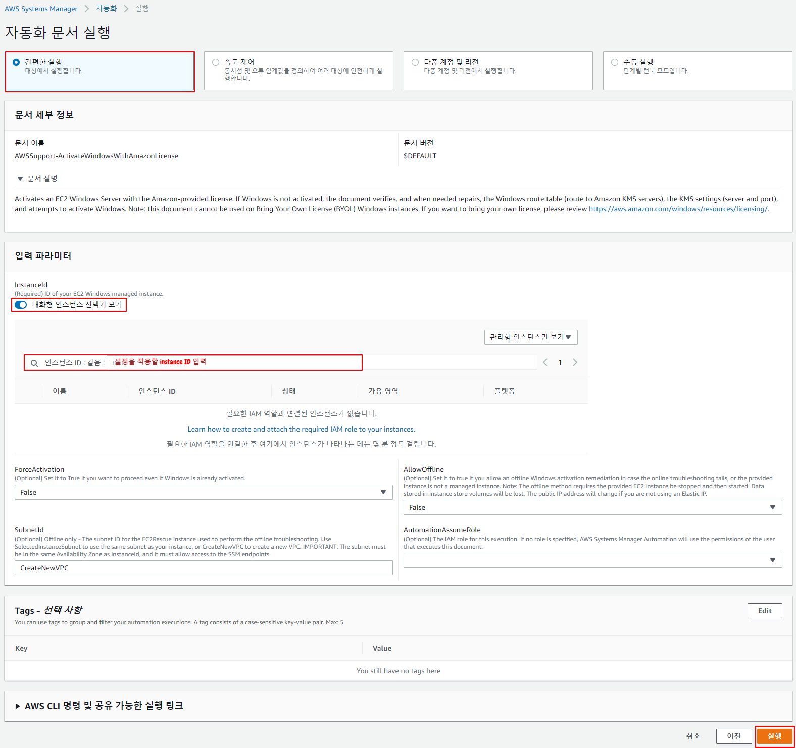

# 디자인 패턴

https://readystory.tistory.com/114

객체지향 프로그래밍에서 공통적인 디자인 문제를 찾아내고 해결하는 가이드

설계자들이 올바른 설계를 빨리 만들 수 있도록 도와줌

### 일반적인 디자인 패턴

> GoF 디자인 패턴

세 가지 범주로 구분: **생성, 행위, 구조**

- 패턴 종류


###### 생성패턴

인스턴스를 만드는 절차를 추상화하는 패턴, 객체를 생성, 합성, 표현 방법을 시스템과 분리

상속(inheritance) 보다 복함(composite) 방법을 사용하는 방향으로 진화

1. 시스템이 어떤 Concrete Class를 사용하는 지에 대한 정보 캡슐화
2. 클래스의 인스턴스들이 만들고 결합하는 부분을 가려줌


###### 구조패턴

작은 클래스들을 상속과 합성을 이용해 더 큰 클래스를 생성하는 방법을 제공

서로 독립적으로 개발한 클래스 라이브러리를 하나인 것처럼 사용

여러 인터페이스를 합성(Composite)하여 서로 다른 인터페이스들의 통일된 추상을 제공

> 런타임 단계에서 복합 방법이나 대상을 변경 -> **유연성**


### 싱글톤 패턴

어떤 클래스의 인스턴스 개수가 **최대 한 개**를 넘지 않도록 하는 패턴

> 프로그램 시작부터 종료 시까지 어떤 클래스의 인스턴스가 메모리 상에 단 하나만 존재할 수 있게 하여 인스턴스에 대해 어디에서나 접근할 수 있도록 하는 패턴

ex) 로그, 쓰레드 풀, 윈도우 관리자 등 객체를 관리하는 역할을 하는 객체 -> 프로그램 내에서 단 하나의 인스턴스를 갖는 것이 좋음

- 공유자원에 대한 소통의 중심 역할

###### 접근방법

- 생성자를 클래스 내부에서 private static하게 만들어 클래스 외부에서 인스턴스를 생성하지 못하게 차단
- 내부에서는 단 하나의 인스턴스를 생성하여 접근 방법 제공

###### 구현

1. Eager Initalization

   > 싱글톤 클래스를 인스턴스 클래스 로딩 단계에서 생성하는 방법

   ```java
   public class Singleton {
       
       // 단 하나의 객체만 허용
       private static final Singleton instance = new Singleton();
       
       private Singleton(){}
    
       //
       public static Singleton getInstance(){
           return instance;
       }
   }
   ```

   - 인스턴스를 사용하지 않더라도 인스턴스를 생성하여 낭비가 발생할 수 있음
   - 큰 리소스에 부적합
   - Exception에 대한 핸들링 제공X

2. Static Block Initailzation

   > static block을 통해 Exception Handling 옵션 제공

   ```java
   public class Singleton {
    
       private static Singleton instance;
       
       private Singleton(){}
       
       //static block initialization for exception handling
       static{
           try{
               instance = new Singleton();
           }catch(Exception e){
               throw new RuntimeException("Exception occured in creating singleton instance");
           }
       }
       
       public static Singleton getInstance(){
           return instance;
       }
   }
   ```

3. Lazy Initalization

   > 나중에 초기화하는 방법

   ```java
   public class Singleton {
    
       private static Singleton instance;
       
       private Singleton(){}
       
       // 인스턴스가 존재하지 않다면 객체 생성
       public static Singleton getInstance(){
           if(instance == null){
               instance = new Singleton();
           }
           return instance;
       }
   }
   ```

   - 인스턴스 낭비 발생X
   - Multi-thread 환경에서 동기화 문제 발생
     - 인스턴스가 생성되지 않은 시점에 여러 쓰레드가 동시에 getInstance() 호출 시, 싱글톤 패턴 위반

4. Thread Safe Singleton

   > getInstance() 메소드에 synchronized를 걸어두는 방식

   ```java
   public class Singleton {
    
       private static Singleton instance;
       
       private Singleton(){}
       
       /*
       synchronized: 임계 영역(Critical Section)을 형성해 해당 영역에 오직 하나의 쓰레드만 접근 가능하게 함
       */
       public static synchronized Singleton getInstance(){
           if(instance == null){
               instance = new Singleton();
           }
           return instance;
       }
       
   }
   ```

   - synchronized 자체 비용이 크기 떄문에 어플리케이션 성능이 떨어짐

   ###### Double Checked Locking

   > instance가 null일 경우에만 synchronized 동작

   ```java
   public static Singleton getInstance(){
       if(instance == null){
           synchronized (Singleton.class) {
               if(instance == null){
                   instance = new Singleton();
               }
           }
       }
       return instance;
   }
   ```

5. **Bill Pugh Singleton Implementation**

   > inner static helper class를 사용, 가장 많이 쓰이는 싱글톤 구현 방식

   ```java
   public class Singleton {
    
       private Singleton(){}
       
       // inner class
       // getInstance가 호출 될 떄, SingletonHelper가 호출됨 -> Synchronized 문제 해결 및 낭비 예방
       private static class SingletonHelper{
           private static final Singleton INSTANCE = new Singleton();
       }
       
       public static Singleton getInstance(){
           return SingletonHelper.INSTANCE;
       }
   }
   ```

   - Refletion을 통해 싱글톤을 파괴할 수 있음

6. Enum Singleton

   ```java
   public enum EnumSingleton {
    
       INSTANCE;
       
       public static void doSomething(){
           //do something
       }
   }
   ```

   - 사용하지 않았을 경우 메모리 문제를 해결하지 못하고 유연성이 떨어지는 한계를 가짐


### 브릿지 패턴

**추상화(abstraction)**를 **구현(implement)**으로부터 분리하여 각각 독립적으로 변화할 수 있도록 하는 패턴 --> 독립적으로 다른 계층 구조를 가짐

- 클라이언트 어플리케이션으로부터 구현을 숨기고 싶을 때 사용



두 인터페이스의 compoistion 구성

```java
public interface Color {
 
	public void applyColor();
}
```

```java
public abstract class Shape {
	//Composition
	protected Color color; //Color 인터페이스 소유
	
	//constructor with implementor as input argument
	public Shape(Color c){
		this.color=c;
	}
	
    // 하위 클래스에게 구현을 위임
	abstract public void applyColor();
}
```


- Shape의 하위 클래스인 Triangle과 Pentagon이 applyColor를 구현함

```java
public class Triangle extends Shape {
 
	public Triangle(Color c) {
		super(c);
	}
 
	@Override
	public void applyColor() {
		System.out.print("Triangle filled with color ");
		color.applyColor();
	} 
 
}
```

```java
public class Pentagon extends Shape {
 
	public Pentagon(Color c) {
		super(c);
	}
 
	@Override
	public void applyColor() {
		System.out.print("Pentagon filled with color ");
		color.applyColor();
	} 
 
}
```


- Color 인터페이스 객체 구현

```java
public class RedColor implements Color{
 
	public void applyColor(){
		System.out.println("red.");
	}
}
```

```java
public class GreenColor implements Color{
 
	public void applyColor(){
		System.out.println("green.");
	}
}
```


- 테스트

```java
public class BridgePatternTest {
 
	public static void main(String[] args) {
		Shape tri = new Triangle(new RedColor());
		tri.applyColor();
		
		Shape pent = new Pentagon(new GreenColor());
		pent.applyColor();
	}
}
```

결과

```
Triangle filled with color red.
Pentagon filled with color green.
```

- Triangle은 RedColor를 가짐 / Pentagon은 GreenColor를 가짐


